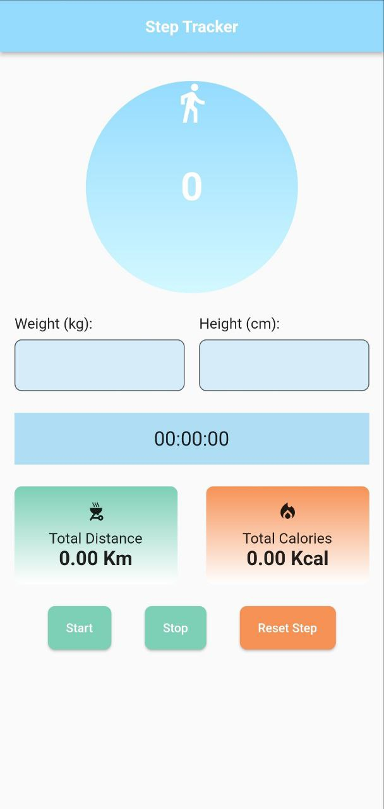
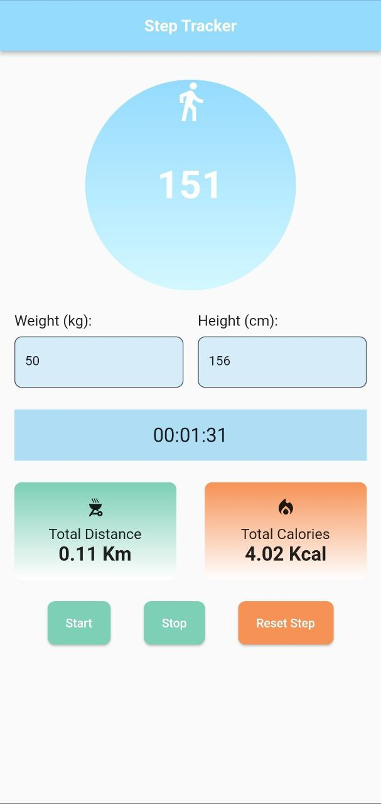

Berikut ini adalah contoh isi berkas README.txt untuk aplikasi Step Tracker:

# Step Tracker App

Step Tracker adalah aplikasi yang digunakan untuk menghitung langkah, jarak total, dan kalori yang terbakar berdasarkan langkah yang diambil oleh pengguna. Aplikasi ini dikembangkan menggunakan Flutter.

## Fitur

- Menghitung jumlah langkah yang diambil oleh pengguna.
- Menghitung jarak total yang ditempuh berdasarkan langkah.
- Menghitung estimasi kalori yang terbakar berdasarkan langkah, berat badan, dan tinggi badan pengguna.
- Menggunakan sensor gyroscope untuk mendeteksi langkah.

## Tampilan Aplikasi

Berikut ini adalah beberapa tangkapan layar dari aplikasi Step Tracker:

 

## Penggunaan

Berikut adalah langkah-langkah untuk menjalankan aplikasi Step Tracker:

1. Pastikan Anda telah menginstal Flutter SDK dan mengatur Flutter di PATH sistem Anda.
2. Clone repositori ini ke komputer Anda.
3. Buka terminal atau command prompt dan arahkan ke direktori proyek Step Tracker.
4. Jalankan perintah `flutter pub get` untuk mengunduh semua dependensi yang diperlukan.
5. Pastikan Anda memiliki perangkat terhubung atau emulator yang berjalan.
6. Jalankan perintah `flutter run` untuk menjalankan aplikasi pada perangkat atau emulator yang tersedia.

## Kontribusi

Kontribusi dan saran untuk pengembangan aplikasi Step Tracker ini sangat diterima. Jika Anda menemukan masalah, bug, atau memiliki fitur baru yang ingin ditambahkan, silakan buat *issue* di repositori ini.

---

Selamat menggunakan aplikasi Step Tracker! Jika Anda memiliki pertanyaan lebih lanjut atau membutuhkan bantuan, jangan ragu untuk menghubungi kami. Terima kasih!
